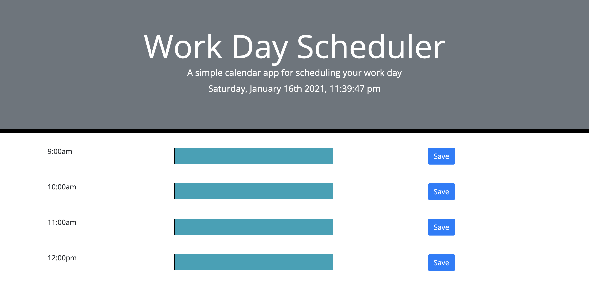
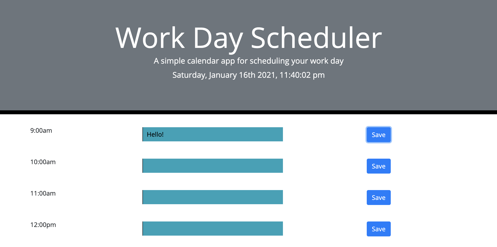
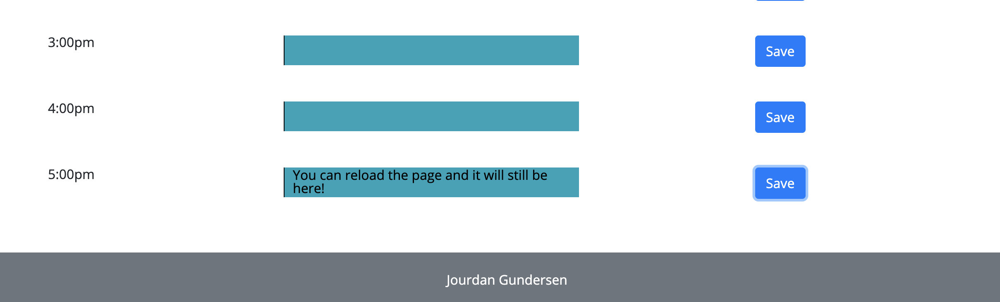

# workdayscheduler

# purpose
- The purpose of this program is to create a daily "calendar" that the user can type data into and save onto their local storage so when the reload or revisit the webpage, it will still be there.

# index.html file walkthrough
- title of the webpage
- created rows for all of the different time slots
- assigned each time slot a different id
- footer at the bottom of the page with the developer's name

# script.js file walkthrough
- created a variable for time
- created a function to display the time and date in the desired format
- created a function that will save the inputted information in the textArea onto localStorage
- created a variable defining what time it currently is
- created a for loop that will change the color of the textArea's depending on the time of day (blue for already happened, yellow for currently happening, and red for upcoming).

# style.css file walkthrough
- font family was created to keep uniformness throughout webpage
- all textareas were made transparent 
- standard css file for this assignment, the color change of the textArea's occurs in the script.js file

# working link - https://jourdangundersen.github.io/workdayscheduler/

# -

# - 
