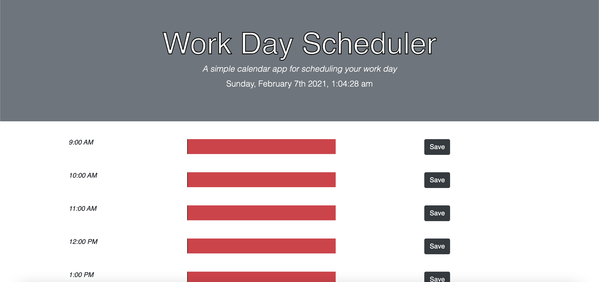
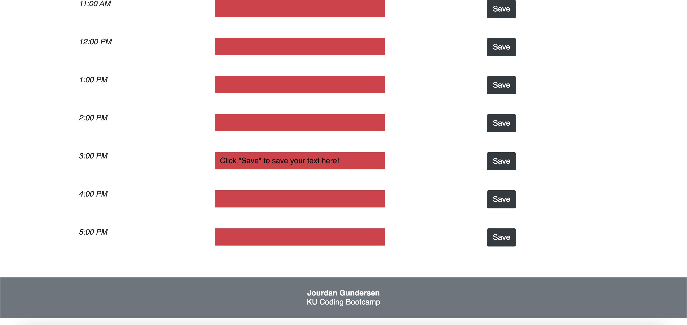

# workdayscheduler

# deployed link
https://jourdangundersen.github.io/workdayscheduler/

# technologies used
HTML, CSS, Javascript, Bootstrap

# the scheduler
This application is designed to be your go-to planner throughout your workday.  Type your plan for the day
in the textArea boxes and then click the "Save" button to store your inputted text in localStorage so you
can refer back to it all day.

# screenshots of deployed application

# contact information
jourdancgundersen@gmail.com
913-439-8833